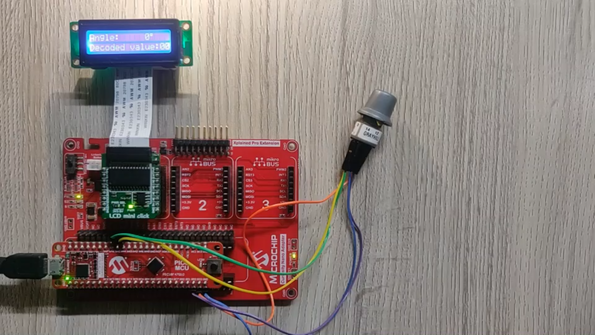
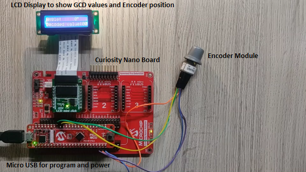
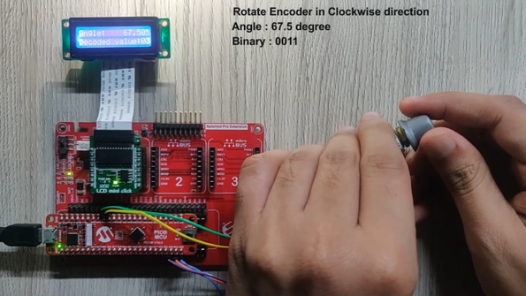
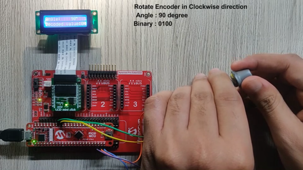
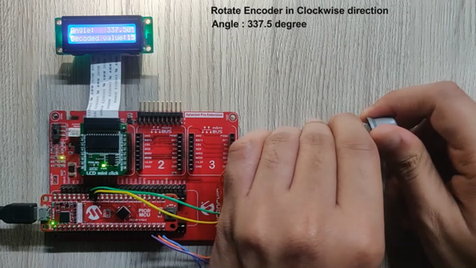

<!-- Please do not change this logo with link -->

# Gray code decoder

This project demonstrate the uses of CLCs in real time applications.In this demo we will realize a Gray code decoder using CLCs.

## Introduction

The PIC18-Q10 family of microcontrollers (MCUs) has a rich set of Core Independent Peripherals (CIPs) like Analog to Digital Converter with Computation (ADCC), Configurable Logic Cell (CLC)s, Timers, Comparators, and so on. These MCUs are equipped with eight CLCs which provides programmable logic that operates outside the speed limitations of software execution. The CLC is a flexible peripheral that enables the creation of on-chip custom logic functions for PIC® MCUs. This Xpress page describes the implementation of Gray code Decoder using PIC18F47Q10 MCU.

## Related Application Note(s)

- [Using CLC in Real Time Applications](http://ww1.microchip.com/downloads/en/AppNotes/AN2912-Using-CLCs-in-Real-Time-Apps_00002912A.pdf "Using CLC in Real Time Applications")
- [Configurable Logic Cells Tips 'n' Tricks](http://ww1.microchip.com/downloads/en/devicedoc/41631b.pdf "Configurable Logic Cells Tips 'n' Tricks")

## Description
In this demonstration, CLCs of PIC18F47Q10 MCU, LCD mini click from MikroElektronika, and Gray-code Encoder from Grayhill, are used for the Gray-code Decoder implementation. Gray-code has been used in several applications such as position Encoders, Mathematical Puzzle, Genetic algorithms, Boolean circuit minimization, Error correction, communication between clock domains, cycling through states with minimal effort, and so on.

 

# Gray Code Decoder Using CLC’s
This section demonstrates the Gray code Decoder using CLC’s. The 4-bit Gray code Encoder input is taken on GPIO pins and is fed to the CLCs. The CLCs perform the logical operation and generate decoded output in binary format. The following figure shows the block diagram of Gray code Decoder implementation using CLCs of PIC18F47Q10 MCU.

  
   Fig 1 : Gray code encoder setup 

The 4-bit rotary encoder from Grayhill is used for the generation of Gray codes.

  
   Fig 2 : Rotary Gray code decoder 

A logic gate-based design is implemented using CLCs of PIC18F47Q10 MCU. The outputs are solved using K-map. The derived logical expressions for Gray code decoder are as follows.
* b (3) = g (3)
* b (2) = g (3) ⊕ g (2)
* b (1) = b (2) ⊕ g (1)
* b (0) = b (1) ⊕ g (0)

The output of CLC’s is routed to four on board LED’s of Curiosity HPC board and it is read in firmware to display it on LCD. Mini LCD Click board from mikroElectronika shows the decoded values in decimal and rotary encoder position in degrees.

## Software Tools
Microchip’s free IDE, compiler and graphical code generators are used throughout the application firmware development. Following are the tools used for this demo application:

* [MPLAB X IDE v5.40](https://www.microchip.com/mplab/mplab-x-ide "MPLAB X IDE v5.40")
* [XC8 Compiler v2.30](https://www.microchip.com/mplab/compilers "XC8 Compiler v2.30")
* [MPLAB Code Configurator (MCC) v4.0.1](https://www.microchip.com/mplab/mplab-code-configurator "MPLAB Code Configurator (MCC) v4.0.1")

**Note: For running the demo, the installed tool versions should be same or later. This example is not tested with previous versions.**

## MCC Settings

## System configuration
The system configuration window of MCC is used for MCU oscillator, PLL, Watchdog timer and low voltage programming configuration. Internal oscillator of 1MHz frequency with clock divider 1 is used as a system clock and the Watchdog timer is disabled in the application.

The following figure shows the system configuration setting in MCC tool.

  
   Fig 3 : System Configuration settings in MCC tool 

## CLC Configuration
The Configurable Logic Cells (CLC’s) are used to decode the encoded Gray-code value by realizing the boolean expressions. This section describes the configuration of CLCs of PIC18F47Q10 MCU using the MCC tool.

* CLC 1: OR-XOR
The following figure shows the CLC 1 in OR-XOR configuration

  
   Fig 4 : CLC 1 - OR-XOR 

* CLC 2: OR-XOR
The following figure shows the CLC 2 in OR-XOR configuration

  
   Fig 5 : CLC 2 - OR-XOR 

* CLC 5: OR-XOR
The following figure shows the CLC 5 in OR-XOR configuration

  
   Fig 6 : CLC 5 - OR-XOR 

* CLC 6: OR-XOR
The following figure shows the CLC 6 in OR-XOR configuration

  
   Fig 7 : CLC 6 - OR-XOR 

## LCD configuration
MCC supports a range of click boards including the LCD mini click.The configurations needed for LCD mini click are, selection of appropriate SPI source, pins and SPI communication speed. The curiosity HPC board mikroBUS slot 1 is used for LCD, I/O pins for the same is selected through pin manager.

## Pin Mapping

  
   Fig 8 : GCD Pin Configuration 

**Note: See the Application Note (AN2912) for more detailed information about MCU configuration, pin connections and Gray-code Decoder application.**

## Hardware setup
The following figure shows the detailed information of the hardware setup.

  
   Fig 9 : Hardware Setup 

Gray-code Decoder demonstration needs input in Gray-code format and the output data in binary format. Input to the Gray-code Decoder is given by the Grayhill Encoder module, output of the Decoder is fed to onboard LEDs to show the output in binary format, as well as CLCs output register is read to show the output on LCD in decimal format.

The required hardware connections are shown in the preceding figure. The figure consists of Gray-code Encoder, LCD mini click, and Curiosity HPC board.

Table consists of the necessary pin mapping information of Gray-code Decoder application.

## Operation

* **Gray Code Decoder Pin Mapping** consists of pin mapping/connection details of the Gray-code Decoder demonstration setup. The hardware connection is made as shown in the Hardware Setup. Power up the curiosity board using micro USB cable.
* Download the firmware available with this Xpress example page.
* Build the project using latest version of tools as mentioned in the Software Tools section and load the generated hexadecimal file in to the PIC18F47Q10 MCU.
* The Encoder used in the demonstration is capable of generating maximum of 15 encoded position values with 22.5° angle of rotation in between them. The rotation can be in clockwise or anti-clockwise direction.

  
   Fig 10 : Hardware Setup 

* After running the program, the initial position of the switch on mechanical encoder is at 0. Hence, the text/data that is displayed on the LCD mini click is **“Angle: 0° Decoded value:00”** as shown in figure above.
* For each change in switch position, the equivalent position value in decimal format and its position angle are displayed on the LCD. Also, the on-board LEDs indicate the Decoder values in binary form.
* Start rotating the knob/switch of Gray-code Encoder module in clock-wise direction/anti-clock wise direction as shown in the following figure.
* Rotate the knob by one step in the clockwise direction to set the position to 1. The equivalent position value (in binary form) and its position angle are displayed on the LCD as **“Angle: 22.5° Decoded value:01”**.

  
   Fig 11 : Rotating Gray Code Encoder Knob 

* Rotate the knob by one step in the clockwise direction to set the position to 2. The eqvuivalent position value (in binary form) and its position angle are displayed on the LCD as **“Angle: 45° Decoded value:02”**.

  
   Fig 12 : Rotating Gray Code Encoder Knob in Clockwise Direction 

* Rotate the knob by one step in the clockwise direction to set the position to 3. The equivalent position value (in binary form) and its position angle are displayed on the LCD as **“Angle: 67.50° Decoded value:03”**.

  
   Fig 13 : Rotating Gray Code Encoder Knob in Clockwise Direction 

* Rotate the knob by one step in the clockwise direction to set the position to 4. The equivalent position value (in binary form) and its position angle are displayed on the LCD as **“Angle: 90° Decoded value:04”**.

  
   Fig 14 : Rotating Gray Code Encoder Knob in Clockwise Direction 

* Rotate the knob in the clockwise direction to set the position to 15. The equivalent position value (in binary form) and its position angle are displayed on the LCD as **"Angle: 337.50° Decoded value:15"**.

  
   Fig 15 : Rotating Gray Code Encoder Knob in Clockwise Direction 

* If the knob is rotated by one step in the clockwise direction and when the position angle on the encoder is at 337.50°, the position angle reaches to 0° and the cycle repeats. Whereas if the knob is rotated in anti-clockwise direction, the rotation angle decreases by 22.5° for each change in step and reaches to 0°.

## Conclusion
This application demonstrates Gray-code Decoder implementation using CLCs, without any software overhead. The logic functions implemented in the hardware have faster event response compared to the logic functions implemented in the software. The CLC gives the advantage of faster and predictable response time over the software implementation. It provides a higher level of integration without the need of external logic gates to implement the logic functions, so it reduces the size of a PCB. It also helps in combining various input source signals using different logic gates to produce different signals. There are a wide range of applications that can be implemented using CLC. Microchip encourages users to explore other possibilities of using CLC.
